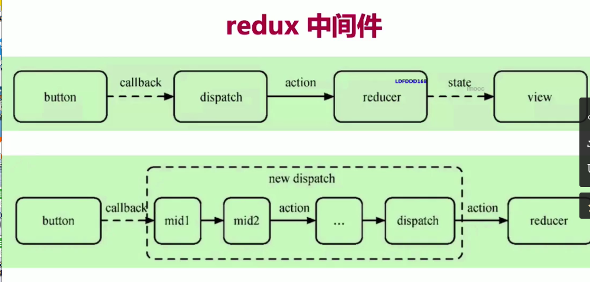
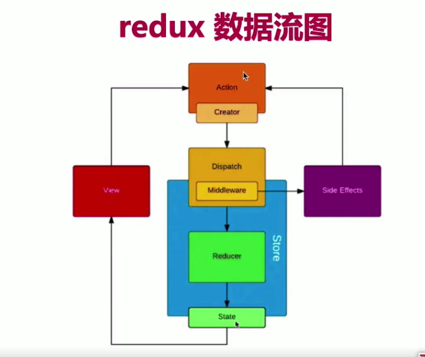

## 基础

### JSX基本使用
### 条件
### 列表
### 表单
### 事件
- 普通函数定义（handleClick () {}） this 默认为undefined - 初始化时绑定事件this
- 静态方法定义 this 指向当前实例。 handleClick = () => {}
- 事件中的 event 不是原生event 是组合事件(SyntheticEvent)； target 指向当前元素， crrentTarget 指向当前元素
- 原生：event.nativeEvent ；target 指向当前元素， crrentTarget 指向document!

react事件总结：
- event 是SyntheticEvent ，模拟出来DOM事件所有能力
- event.nativeEvent 是原生事件对象
- 所有事件，都被挂载到document上
- 和DOM事件不一样，和Vue事件也不一样

- event参数，自定义参数 event参数自动跟在最后面


### setState
- state一定要放在构造函数中定义
- 不可变值(函数式编程-纯函数) @@!important!! React基石
- 可能是异步更新
- 可能会被合并

```javascript
- 不要直接修改state，使用不可变值

- setState 完直接拿结果，拿不到，是异步; 在第二个参数(回调中 相当于nextTick)中拿是同步
this.setState({
  count: this.state.count + 1
}, () => {})
- 在setTimeout 中是同步的
- 在自定义DOM事件中是同步

- 传入对象，会被合并，(类似Object.assign)
this.setState({count: this.state.count + 1})
- 传入函数，不会合并
this.setState((preVal, props) => {
  return {
    count: preVal.count + 1
  }
})
```

### 生命周期

https://projects.wojtekmaj.pl/react-lifecycle-methods-diagram/

挂载 constructor-->render-->React更新DOM和refs-->componentDidMount
更新 render --> React更新DOM和ref --> componentDidUpdate shouleComponentUpdate
卸载 componentWillUnmount

## 高级特性
### 函数组件
- 纯函数，输入props，输出JSX
- 没有实例，没有生命周期，没有state

### 非受控组件
`定义`
- ref
- defaultValue defaultChecked
- 手动操作dom元素
```javascript
// 定义
this.nameInputRef = React.createRef()
// 使用  
<input type="file" ref={this.fileInputRef} />
// 获取
let val = this.fileInputRef.current.files[0].name
```
`使用场景`
- 必须手动操作dom，setState 实现不了
- 文件上传 <input type="file">
- 某些富文本编辑器，需要获取dom

`受控组件 VS 非受控组件`
- 优先使用受控组件，复合React设计原则
- 必须操作dom时，再使用非受控组件

### Portals (传送门)

```javascript
render() {
  return ReactDOM.createProtal(
    // this.props.children 类似 vue slot
    <div className="modal"> {this.props.children} </div>,
    document.body // dom节点
  )
} // hack
```

`使用场景`
- overflow:hidden
- 父组件z-index值太小
- flxed需要放在body第一层

### context

```javascript
// 创建 Context 填入默认值(任何一个 js 变量)
const ThemeContext = React.createContext('light)

// 提供方组件使用
class App extends React.Component {
  constructor(props) {
    super(props)
  }
  render() {
    return (<ThemeContext.Provider value={this.state.theme}>
      <Component1 />
      <Component2 />
    </ThemeContext.Provider>)
  }
}

// 消费方组件使用-Component1(class组件)
const class Component1 extends React.Component {
  // static contextType = ThemeContext // ES6写法 
  render() {
    const theme = this.context
    return <div> theme is {theme} </div>
  }
}
Component1.contextType = ThemeContext


// 消费方组件使用-Component2(函数组件)
function Component2(props) {
  // const theme = this.context 会报错，函数式组件没有实例

  return <ThemeContext.Consumer>
    { value => <p> link is { value } </p> }
  </ThemeContext.Consumer>
}
```

### 异步组件
- import()
- React.lazy
- React.Suspense

```javascript
const ContextDemo = React.lazy(() => import('./ContextDemo'))

class App extends React.Component {
  constructor(props) {
    super(props)
  }
  render() {
    return <div>
      <p>引入一个动态组件</p>
      <hr/>
      <React.Suspense fallback={ <div>loading...</div> }>
        <ContextDemo/>
      </React.Suspense>
    </div> 
  }
}
```
- 更改chrome 网速查看效果:Performance -->  NetWork --> Online 改为 fast3g

### 性能优化
- shouldComponentUpdate
- PureComponent 和 React.memo
- 不可变值 immutable.js - 彻底拥抱不可变值
- state层级

```javascript
shouldComponentUpdate(nextProps, nextState) {
  if(nextState.count !== this.state.count) {
    return true // 可以渲染
  }
  return false // 不重复渲染
}
```
- React 默认父组件更新，子组件也无条件更新
- SCU 默认返回true，即React默认更新所有子组件
- SCU 一定要配合不可变值

- PureComponent, SCU 中实现了浅比较
- memo, 函数式组件中的 PureComponent
- 浅比较适用大部分情况
 
```javascript
// PureComponent
// 相当于在组建中添加了 shouldComponentUpdate 生命周期并声明浅比较(shallowCompare)
class App extends React.PureComponent {
  constructor(props) {
    super(props)
  }
  render() {
    const { list } = this.props
    return <ul>
      { list.map((item,index) => <li key={item.id}>{item.name}</li>) }
    </ul>
  }
}

// memo
function MemoComponent(props) {
  /* render */
}
function areEqual(prevProps, nextProps) {
  /**
    如果把nextProps传入render 方法返回结果与prevProps返回一致，
    则返回true，否则返回false
  */
}
export default React.memo(MemoComponent, areEqual)
```

### 高阶组件HOC height-order-components
### Render Props
`React 组件抽离`
- 高阶组件HOC
- Render Props

```javascript
// 高阶组件不是一种功能，而是一种模式
const HOCFactory = (Component) => {
  class HOC extends React.Component {
    // 在此定义多个组件的公共逻辑
    render() {
      return <Component {...this.props} /> // 返回拼装的结果
    }
  }
  return HOC
}

const EnhancedComponent1 = HOCFactory(WrappedComponent1)
const EnhancedComponent2 = HOCFactory(WrappedComponent2)

// ----------------------实例--------------------------------
const withMouse = (Component) => {
  class withMouseComponent extends React.Component {
    constructor(props) {
      super(props)
      this.state = { x:0, y: 0 }
    }

    handleMouseMove = (event) => {
      this.setState({
        x: event.clientX,
        y: event.clientY,
      })
    }

    render() {
      return(
        <div style={{height: '500px'}} onMouseMove={this.handleMouseMove}>
          { /* 1. 穿透所有props 2. 增加mouse属性 */ }
          <Component {...this.props} mouse={this.state} />
        </div>
      )
    }
  }
}

const App = (props) => {
  const { x, y } = props.mouse // 接收mouse属性
  return (
    <div style={{height: '500px'}}>
      <h1> The mouse position is({x}, {y}) </h1>
    </div>
  )
}

export default withMouse(App) // 返回高阶函数

// *****************************render props**************************************
// Render Props 核心思想
// 通过一个函数将class组件的 state 作为props传递给纯函数组件
class Factory extends React.Component {
  constructor() {
    this.state = {
      /* 多个组件的公共逻辑数据 */
    }
  }
  /* 修改state */
  render() {
    return <div>{this.props.render(this.state)}</div>
  }
}
const App = () => {
  <Factory render={
    // redner 是一个函数组件
    (props) => <p> {props.a}, {props.b}... </p>
  } />
}

// ----------------------实例--------------------------------
class Mouse extends React.components {
  constructor(props) {
    super(props)
    this.state = {x:0, y:0}
  }
  handleMouseMove = (event) => {
    this.setState({
      x: event.target.clientX,
      y: event.target.clientY,
    })
  }
  render() {
    return (
      <div style={{height: '500px'}} onMouseMove={this.handleMouseMove}>
        { /* 将当前state作为props,传递给render(函数组件) */ }
        {this.props.render(this.state)}
      </div>
    )
  }
}
Mouse.propTypes = {
  render: PropTypes.func.isRequired // 必须，函数类型
}
const App = () => (
  <div style={{height: '500px'}}>
    <Mouse render={
      /* render是一个函数组件 */
      ({x, y}) => <h1>The Position is {x}, {y}</h1>
    } />
  </div>
)
```
- HOC模式简单，但会增加组件层级
- Render Props 代码简介，学习成本稍高
- redux中connect是高阶组件

### Redux
`基本概念`
- store state
- action
- reducer
`单项数据流概述`
- dispatch(action)
- reducer -> newState
- subscribe 触发通知
`react-redux`
- Provider // 提供数据 
- connect // 高阶组件，将dispatch作为props注入到组件中
- mapStateToProps  
`异步action`
```javascript
// 同步
export const addTodo = text => {
  // 返回action对象
  return {
    type: 'ADD_TODO',
    id: nextTodo++,
    text
  }
}

// 异步action
export const addTodoAsync = text => {
  // 返回函数，其中有dispatch函数
  return (dispatch) => {
    // ajax 异步获取数据
    fatch(url).then(res => {
      // 执行异步action
      dispatch(addTodo(res.text))
    })
  }
}

// 使用异步action, 需要引入中间件
import { createStore, applyMiddleware } from 'redux';
import thunk from 'redux-thunk';
import rootReducer from './reducers/index';
// 创建store时，作为中间件引入redux-thunk || redux-promise || redux-saga
const store = createStore(rootReducer, applyMiddleware(thunk))

```
`redux 中间件`

- 中间件插在dispach中

`redux 数据流图`


### React-router
- 路由模式 hash/H5history
- 路由懒加载-组件懒加载 lazy

## 总结
- 基础
JSX
条件
列表渲染
事件
组件和props
state和setState
组件声明周期

- 高级特效
函数组件
受控/非受控组件
refs
Protals
context
异步组件(懒加载)
性能优化
SCU
纯组件 pureComponent
高阶组件
render props 

-redux
store
reducer
action
dispatch
单项数据流模型
中间件redux-thunk/redux-saga

- react-redux
provider
connect
mapStateToProps
mapDispatchToProps

- react-router
