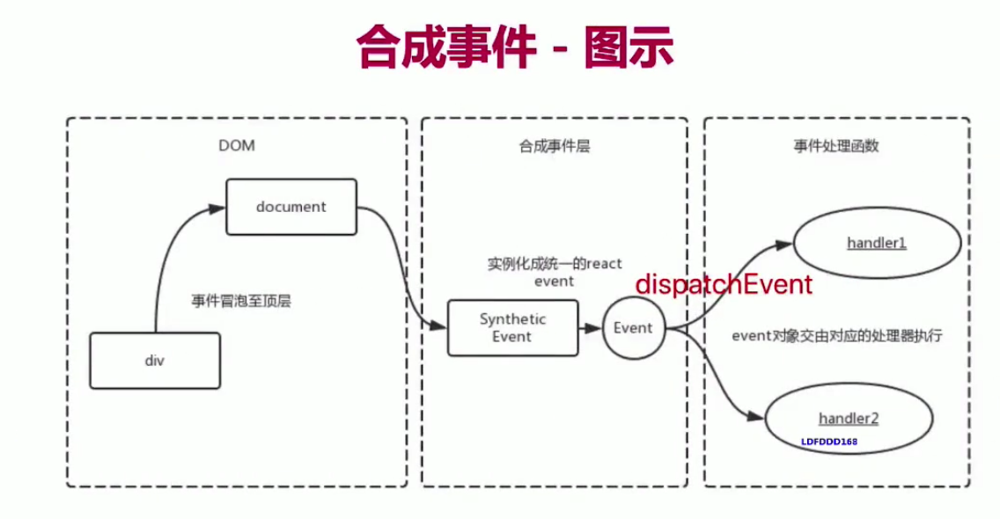
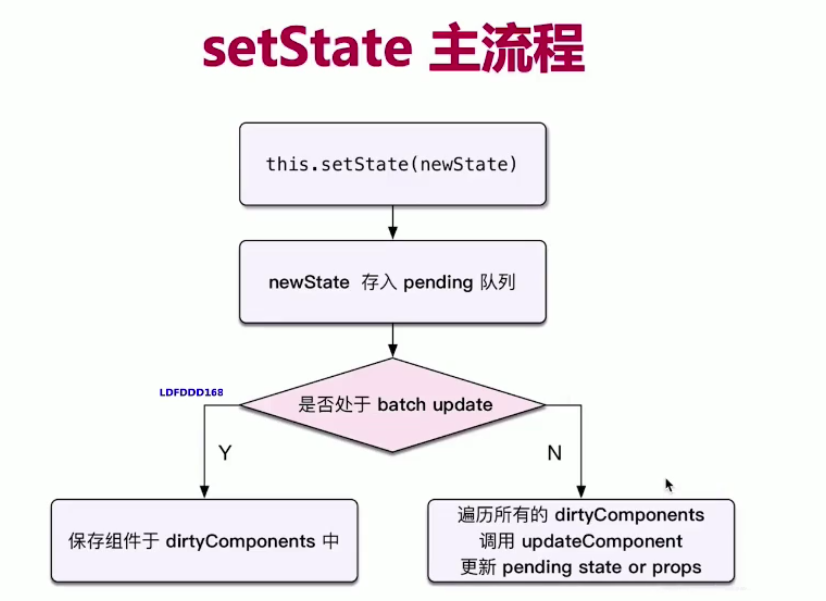
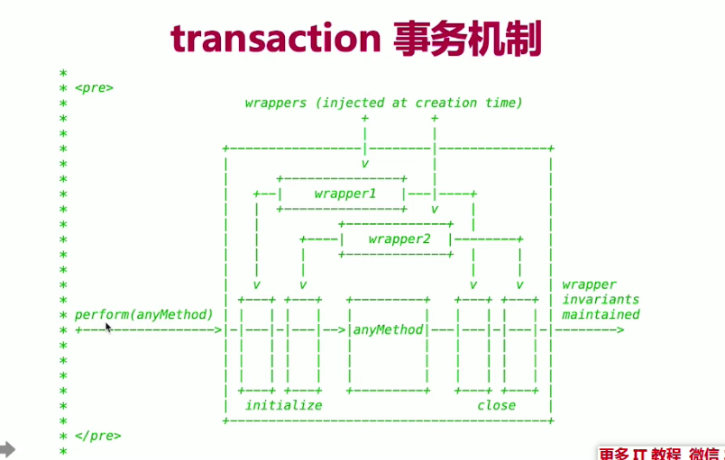

## React 原理
- 函数式编程
- vdom 和 diff
- JSX的本质
- 合成事件
- setState batchUpdate
- 组件渲染过程


### 函数式编程

- 纯函数和不可变值

### JSX 的本质是什么
- JSX等同于Vue模板
- vue 模板不是html -- vue-templete-complier
- JSX 不是 js -- babel

  
// h函数
// 返回vnode
// params1 tag/ComponentName
// params2 props/null
// params3 []/Component
React.createElement('tag', {id: 'div1'}, child1, child2, child3) 或者
React.createElement('tag', {id: 'div1'}, [child1, child2, child3])

`总结`
- createElement 即h函数，执行返回vnode
- 第一个参数，可能是组件，也可能是 html tag
- 组件名，首字母必须大写(React规定)

### 合成事件
- 所有事件挂载到document上
- event 不是原生的，是SyntheticEvent合成事件对象
- 和Vue事件不同,和DOM事件也不同


`为什么要合成事件`
- 更好的兼容性和跨平台
- 挂载到document上,减少内存消耗，避免频繁解绑
- 方便事件的统一管理(如事务机制)

### setState 和 batchUpdate
- 有时异步(普通使用)，有时同步(setTimeout，自定义DOM事件)
- 有时合并(对象形式)，有时不合并(函数形式)

`setState主流程`
`batchUpdate机制`

```javascript
class ListDemo extends React.Component {
  constructor(props){
    this.state = {
      count: 0
    }
  }
  render() {
    return <div> {this.state.count} </div>
  }
  increase = () => {
    // 异步
    // 开始：处于batchUpdate
    // isBatchingUpdates = true
    // setState时判断isBatchingUpdates 为true，说明命中batchUpdate机制，走异步，反之走同步
    this.setState({
      count: this.state.count + 1
    }, () => {
      // 回调函数中可以难道最新的state
      console.log(this.state.count)
    })
    // 异步的，拿不到最新值
    console.log(this.state.count)
    // ----------------------------
    /*
    setTimeout(() => {
      // 此时 isBatchingUpdates是false
      this.setState({
        count: this.state.count +1
      })
      // 同步，可以拿到
      console.log(this.state.count)
    })
    */
   
    // 结束
    // isBatchingUpdates = false
  }
}
```
- setState无所谓异步还是同步
- 看是否命中batchUpdate机制
- 判断是否命中看isBatchingUpdates变量是true/false

哪些能命中batchUpdate机制
- 生命周期(和它调用的函数)
- React中注册的事件(和它调用的函数)
- React可以'管理'的入口

哪些不能命中batchUpdate机制
- setTimeout/setInterval
- 自定义DOM事件(documnent.addEventListener('click', onClick))
- React'管不到'的入口

`transaction(事务)机制`


- 在事件的开始和结束做一些事情
